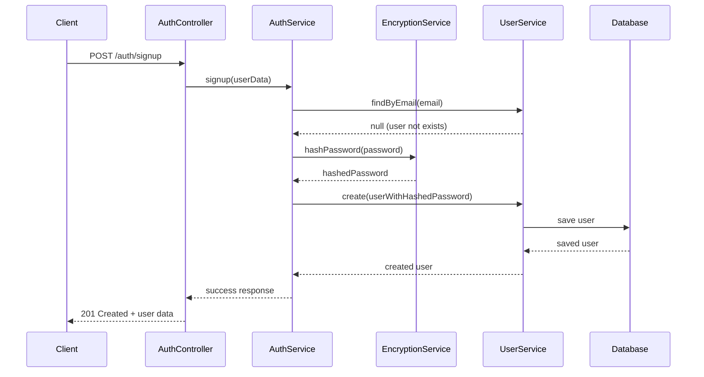
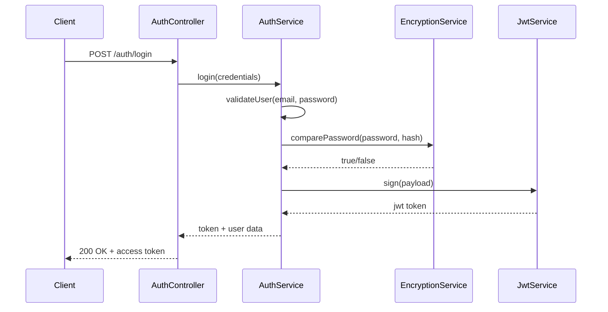
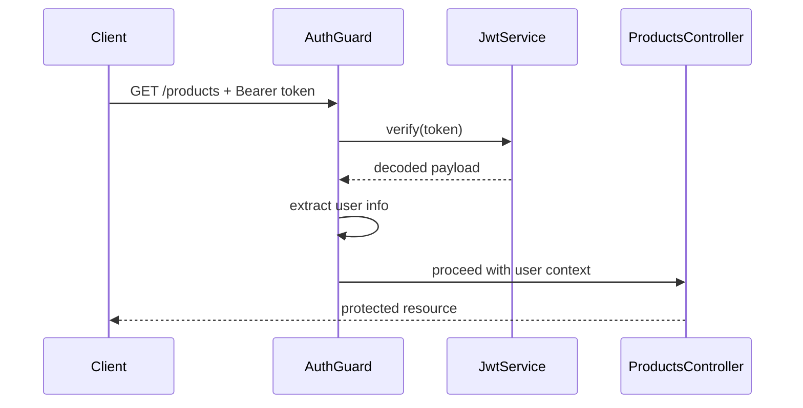

# Autenticação

## Visão Geral

A Ton Products API implementa um sistema de autenticação robusto baseado em **JWT (JSON Web Tokens)** com criptografia **bcrypt** para senhas.

## Arquitetura de Autenticação

```
┌─────────────────┐    ┌─────────────────┐    ┌─────────────────┐
│   Auth Guard    │    │  Auth Service   │    │ Encryption Svc  │
│                 │    │                 │    │                 │
│ • JWT Validation│────│ • Login Logic   │────│ • bcrypt Hash   │
│ • Route Protection│   │ • Token Gen     │    │ • Password Cmp  │
│ • User Context  │    │ • User Validation│   │ • Salt Generation│
└─────────────────┘    └─────────────────┘    └─────────────────┘
         │                       │                       │
         └──────────────────┬────────────────────────────┘
                           │
                ┌─────────────────┐
                │   User Service  │
                │                 │
                │ • User CRUD     │
                │ • Profile Mgmt  │
                │ • Email Search  │
                └─────────────────┘
```

## Fluxo de Autenticação

### 1. **Registro de Usuário (Signup)**



### 2. **Login de Usuário**



### 3. **Proteção de Rotas**



## Componentes de Segurança

### **1. EncryptionService**

Serviço centralizado para operações criptográficas:

```typescript
@Injectable()
export class EncryptionService {
  async hashPassword(password: string): Promise<string> {
    const saltRounds = parseInt(ENV.SALT_ROUNDS);
    return await bcrypt.hash(password, saltRounds);
  }

  async comparePassword(password: string, hash: string): Promise<boolean> {
    return await bcrypt.compare(password, hash);
  }

  async generateSalt(rounds?: number): Promise<string> {
    return await bcrypt.genSalt(rounds || parseInt(ENV.SALT_ROUNDS));
  }
}
```

**Características:**
- Abstração completa do bcrypt
- Configuração via variáveis de ambiente
- Facilita mudanças futuras de biblioteca
- Métodos para hash, comparação e geração de salt

### **2. JWT Strategy**

Estratégia de validação de tokens JWT:

```typescript
@Injectable()
export class JwtStrategy extends PassportStrategy(Strategy) {
  constructor() {
    super({
      jwtFromRequest: ExtractJwt.fromAuthHeaderAsBearerToken(),
      ignoreExpiration: false,
      secretOrKey: ENV.JWT_SECRET,
    });
  }

  async validate(payload: any) {
    return { 
      userId: payload.sub, 
      email: payload.email 
    };
  }
}
```

### **3. Auth Guard**

Guard para proteção de rotas:

```typescript
@Injectable()
export class JwtAuthGuard extends AuthGuard('jwt') {
  canActivate(context: ExecutionContext) {
    return super.canActivate(context);
  }

  handleRequest(err, user, info) {
    if (err || !user) {
      throw err || new UnauthorizedException();
    }
    return user;
  }
}
```

## Configuração

### **Variáveis de Ambiente**

```env
# JWT Configuration
JWT_SECRET=your-super-secret-jwt-key-here
JWT_EXPIRES_IN=7d

# Encryption Configuration
SALT_ROUNDS=12
```

### **JWT Module Configuration**

```typescript
JwtModule.register({
  secret: ENV.JWT_SECRET,
  signOptions: { 
    expiresIn: '7d',
    issuer: 'ton-products-api',
    audience: 'ton-products-client'
  },
})
```

## Funcionalidades

### **Registro (Signup)**
- Validação de email único
- Hash da senha com salt
- Criação de usuário no banco
- Resposta sem dados sensíveis

### **Login**
- Validação de credenciais
- Geração de JWT token
- Payload customizado
- Expiração configurável

### **Proteção de Rotas**
- Middleware automático
- Extração de usuário do token
- Validação de expiração
- Contexto de usuário disponível

## Segurança Implementada

### **1. Password Security**
- **bcrypt** com salt rounds configurável
- **Minimum complexity** (pode ser estendido)
- **No plaintext storage**

### **2. JWT Security**
- **Secret key** via env variable
- **Token expiration**
- **Stateless design**
- **Bearer token format**

### **3. Route Protection**
- **All product routes protected**
- **Automatic user context**
- **Centralized guard**

### **4. Error Handling**
- **No sensitive data in responses**
- **Generic error messages**
- **Proper HTTP status codes**

## Validações

### **Signup Validation**
```typescript
export class SignupDto {
  @IsString()
  @IsNotEmpty()
  name: string;

  @IsEmail()
  email: string;

  @IsString()
  @MinLength(6)
  password: string;
}
```

### **Login Validation**
```typescript
export class LoginDto {
  @IsEmail()
  email: string;

  @IsString()
  @IsNotEmpty()
  password: string;
}
```

## Testando Autenticação

### **1. Registro**
```bash
curl -X POST http://localhost:3000/auth/signup \
  -H "Content-Type: application/json" \
  -d '{
    "name": "Test User",
    "email": "test@example.com",
    "password": "test123456"
  }'
```

### **2. Login**
```bash
curl -X POST http://localhost:3000/auth/login \
  -H "Content-Type: application/json" \
  -d '{
    "email": "test@example.com", 
    "password": "test123456"
  }'
```

### **3. Rota Protegida**
```bash
curl -X GET http://localhost:3000/products \
  -H "Authorization: Bearer YOUR_JWT_TOKEN_HERE"
```

## Futuras Melhorias

### **Refresh Tokens**
- Implementar refresh token strategy
- Rotação automática de tokens
- Logout com blacklist

### **Role-Based Access Control (RBAC)**
- Diferentes níveis de acesso
- Permissões granulares
- Admin vs User roles

### **Multi-Factor Authentication (MFA)**
- TOTP integration
- SMS verification
- Backup codes

### **Password Policy**
- Complexity requirements
- Password history
- Expiration policies

### **Rate Limiting**
- Login attempt limits
- API rate limiting
- Brute force protection